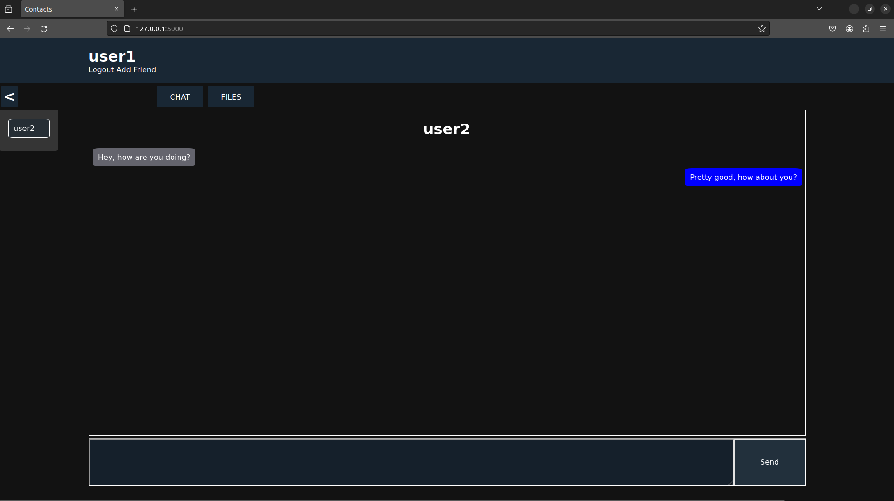
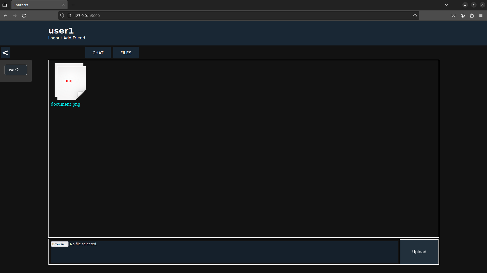

# vchat
Chat application for your local network. Send files &amp; messages between your devices.

## About
<b>vchat</b> is a chat application to run on your local network to devices for situations when you need to easily send some text or files from one to the other.

You can register multiple users (one for each device) or log on as the same user on each device.

#### The Chat Window


#### The Files Window


## Installation & Setup

First, pick the computer you'd like to run as a server and follow the steps from there and make sure [Python](https://www.python.org/downloads/) is installed.

1. Clone this repository into a folder.
2. Create a [virtual environment](https://docs.python.org/3/library/venv.html).
3. Activate your virtual environment and install Flask.
   
     ```pip install Flask```
4. Initialize the database.

    ```flask --app vchat init-db```
  
5. Determine the local [IP Address](https://geekflare.com/find-ip-address-of-windows-linux-mac-and-website/) of your computer.
   
6. Start the server.
   
    ```flask -app vchat run -h YOUR_IP_ADDRESS```

    The above command defaults the port number to 5000. If you do not want to run it on that port.

    ```flask -app vchat run -h YOUR_IP_ADDRESS -p YOUR_PORT```
  
7. Direct your browser to the IP address followed by the port number.
   
    For example if your IP address is 192.168.1.1 and you used the default port. Then you would go to 192.168.1.1:5000.
